# Cauldron V4 业务逻辑图

## 📊 系统架构概览

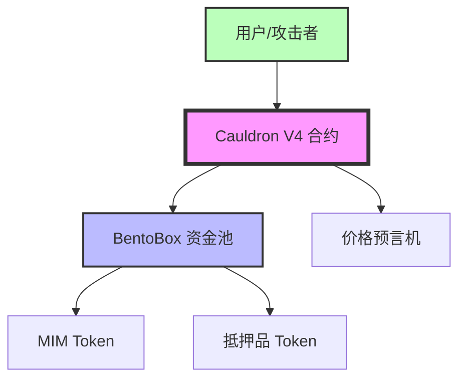

## 🏗️ Cauldron核心组件

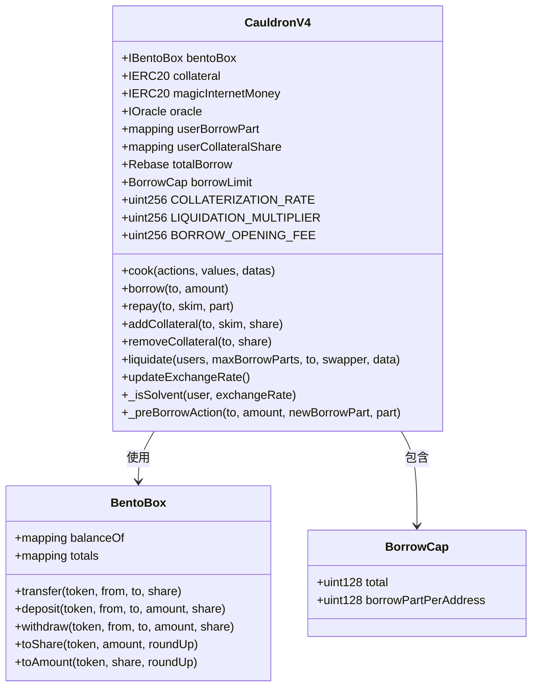

## 🔄 Cook函数工作流程

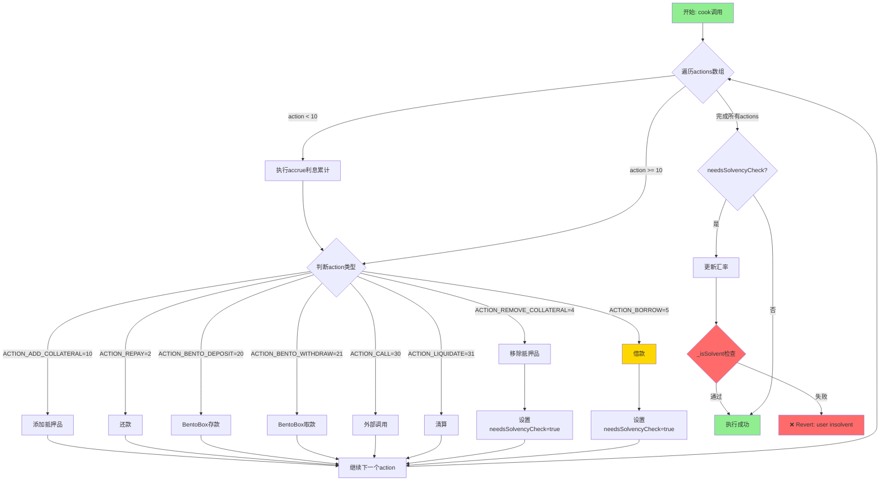

## 💰 借款流程详解 (ACTION_BORROW)

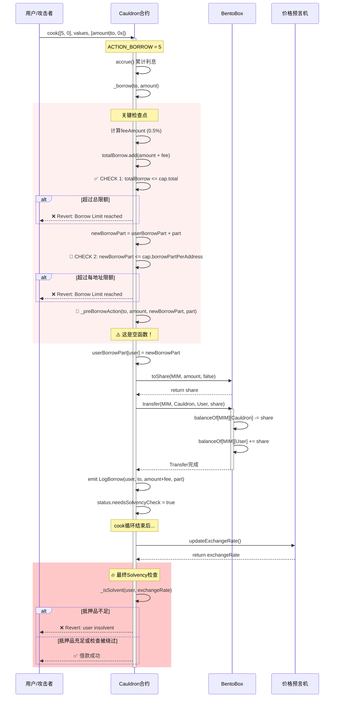

## 🔒 Solvency检查机制

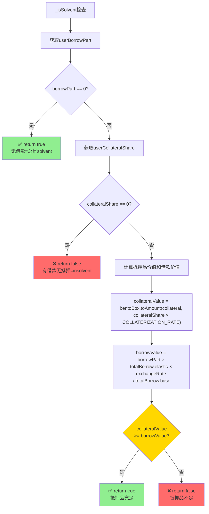

## 🚨 攻击向量分析

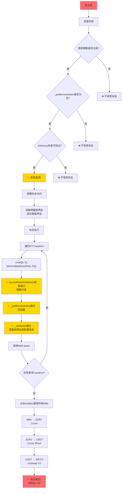

## 💸 还款流程 (ACTION_REPAY)

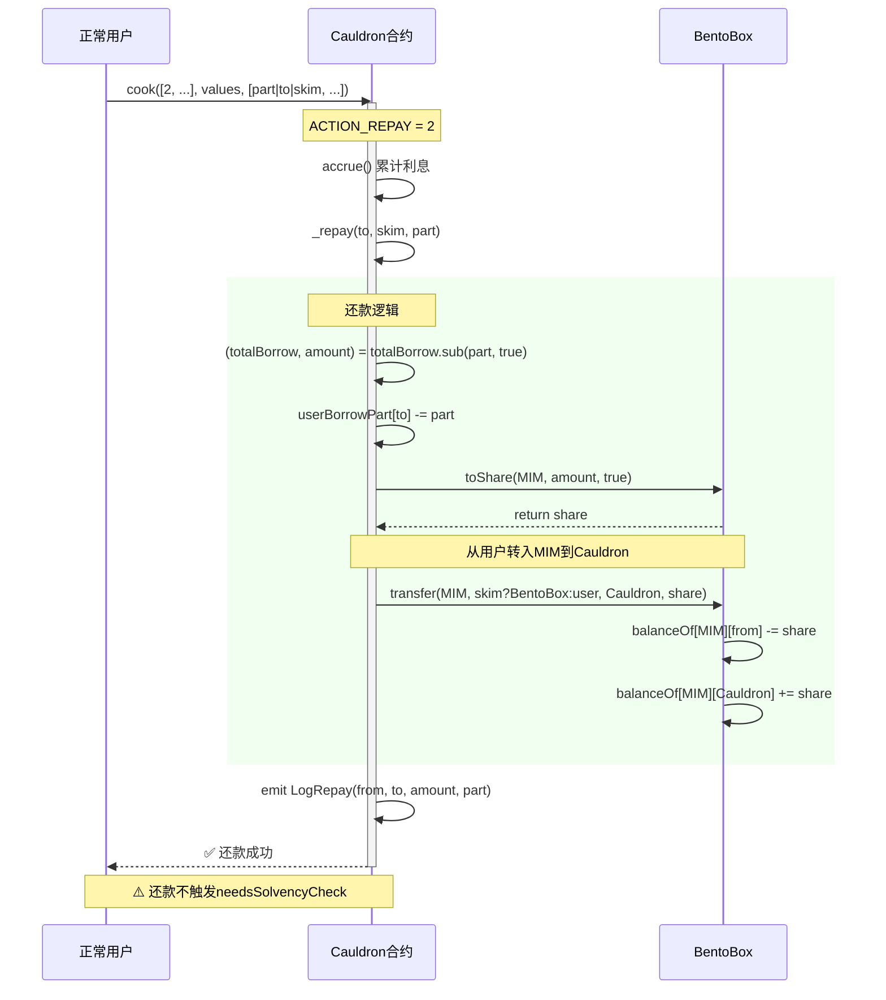

## 🏦 抵押品管理

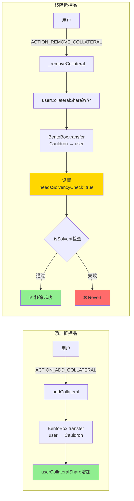

## ⚡ 清算流程

```mermaid
flowchart TD
    Start[清算开始] --> UpdateRate[updateExchangeRate]
    UpdateRate --> Accrue[accrue利息]
    Accrue --> LoopUsers[遍历待清算用户]
    
    LoopUsers --> CheckSolvent{_isSolvent检查}
    CheckSolvent -->|solvent| Skip[跳过该用户]
    CheckSolvent -->|insolvent| CalcLiq[计算清算金额]
    
    CalcLiq --> CalcBorrow[borrowAmount = totalBorrow.toElastic(borrowPart)]
    CalcBorrow --> CalcCollateral["collateralShare = <br/>borrowAmount × LIQUIDATION_MULTIPLIER × exchangeRate"]
    
    CalcCollateral --> UpdateState[更新状态]
    UpdateState --> SubBorrow[userBorrowPart减少]
    SubBorrow --> SubCollateral[userCollateralShare减少]
    
    SubCollateral --> TransferCol[转移抵押品给清算人]
    TransferCol --> EmitEvents[发出清算事件]
    
    EmitEvents --> NextUser{还有更多用户?}
    NextUser -->|是| LoopUsers
    NextUser -->|否| SwapIfNeeded{需要交换抵押品?}
    
    SwapIfNeeded -->|是| CallSwapper[调用Swapper合约]
    SwapIfNeeded -->|否| End[清算完成]
    CallSwapper --> End
    
    Skip --> NextUser
    
    style CheckSolvent fill:#FFD700
    style CalcCollateral fill:#FFB6C1
    style End fill:#90EE90
```

## 📊 BentoBox交互模式

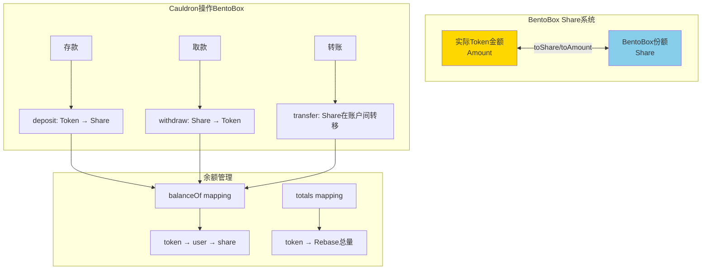

## 🔐 关键安全检查点总结

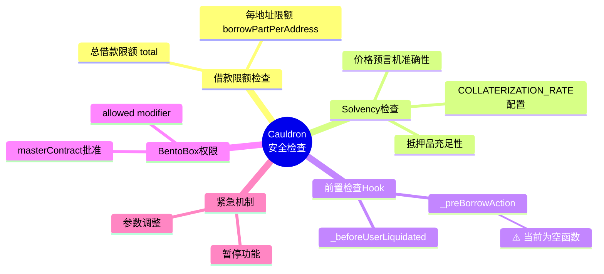

## 🎯 漏洞利用路径图

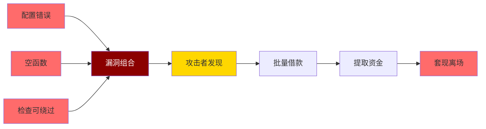

## 📈 正常vs攻击场景对比

```mermaid
flowchart TD
    subgraph 正常借款场景
        N1[用户存入抵押品<br/>150%抵押率] --> N2[调用borrow<br/>合理金额]
        N2 --> N3[✅ borrowPartPerAddress检查<br/>通过]
        N3 --> N4[✅ _preBorrowAction<br/>通过或为空]
        N4 --> N5[✅ _isSolvent检查<br/>150%抵押率通过]
        N5 --> N6[✅ 获得借款<br/>正常使用]
    end
    
    subgraph 攻击场景
        A1[攻击者无/微量抵押品<br/>0-10%抵押率] --> A2[调用cook with ACTION_BORROW<br/>最大金额]
        A2 --> A3[✅ borrowPartPerAddress检查<br/>配置过高-通过!]
        A3 --> A4[✅ _preBorrowAction<br/>空函数-通过!]
        A4 --> A5[✅ _isSolvent检查<br/>被绕过-通过!]
        A5 --> A6[✅ 窃取大量MIM<br/>$1.7M]
    end
    
    style N6 fill:#90EE90
    style A6 fill:#FF6B6B
    style A3 fill:#FFD700
    style A4 fill:#FFD700
    style A5 fill:#FFD700
```

---

## 📝 图表说明

### 使用的颜色代码
- 🟢 绿色: 正常流程/成功操作
- 🔴 红色: 错误/攻击/失败
- 🟡 黄色: 关键检查点/警告
- 🔵 蓝色: 系统组件
- 🟣 紫色: 核心合约

### 关键符号
- ✅ 检查通过
- ❌ 检查失败/Revert
- 🔴 高风险点
- ⚠️ 警告/注意事项
- 🔥 漏洞利用点

---

**文档版本**: 1.0  
**生成时间**: 2025-10-12  
**基于**: Cauldron V4 实际合约源代码分析

